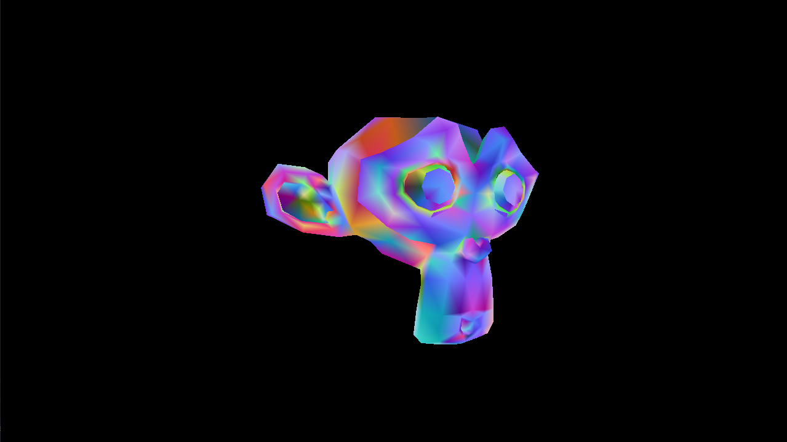

# Software Renderer



This is a project made for educational purposes. I got inspired to build it while attending my graphics programming introductory course. The first 3 laboratories covered how rendering works by helping us build a basic software renderer. This is a continuation of that with the addition of a custom SIMD math library. 

The project in its current state is almost done, but not quite. The most obvious missing feature is the lack of any type of rendering effect, such as diffuse colors, texturing, lighting etc. I worked on the SIMD math library, ensuring correct rendering with no artifacts and profiling and optimizing, which consumed most of my time. Once I have more free time and I am done with my masters I plan on returning to this to finish it. 

### Current features

- SIMD math library
- Unit testing to ensure correctness
- Basic rendering of objects, displaying the normals

### Planned features

- Better test coverage
- Custom pipelines using function pointers as vertex/fragment shaders
- Exploring multithreading

Currently, the latest work I have done can be found on the renderer-clipping branch. I was last working on the triangle clipping algorithm, this branch being an update to the renderer which is being implemented on the renderer branch. The main branch has not been updated in a while.

## Dependencies

- Catch2 - unit testing framework
- glfw - window and OpenGL context creation
- gl3w - OpenGL dynamic function loading library
- fast_obj - 3D model obj loader

They are all installed by CMake using FetchContent.

## Requirements

- CMake 3.23 or higher (one which supports CMake < 3.5)
- MinGW 15.2.0 or equivalent


## Build steps

```
git clone github.com/Rocco2300/software-renderer

cd software-renderer
mkdir build
cd build
cmake .. -G "MinGW Makefiles" -DCMAKE_BUILD_TYPE=Release
cmake --build .

./software-renderer/software-renderer.exe
```